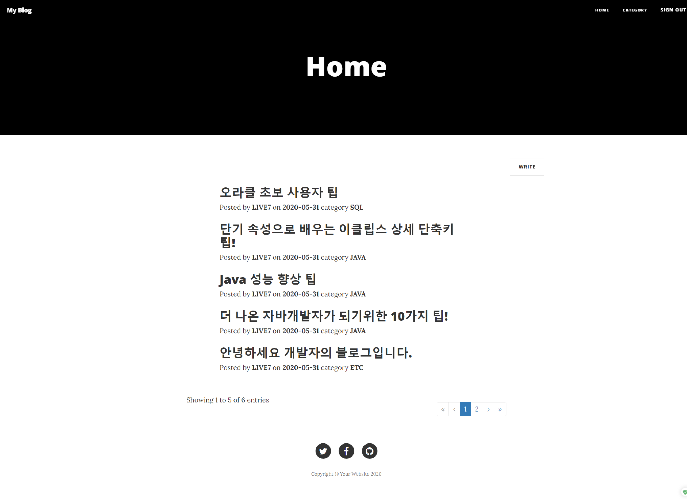
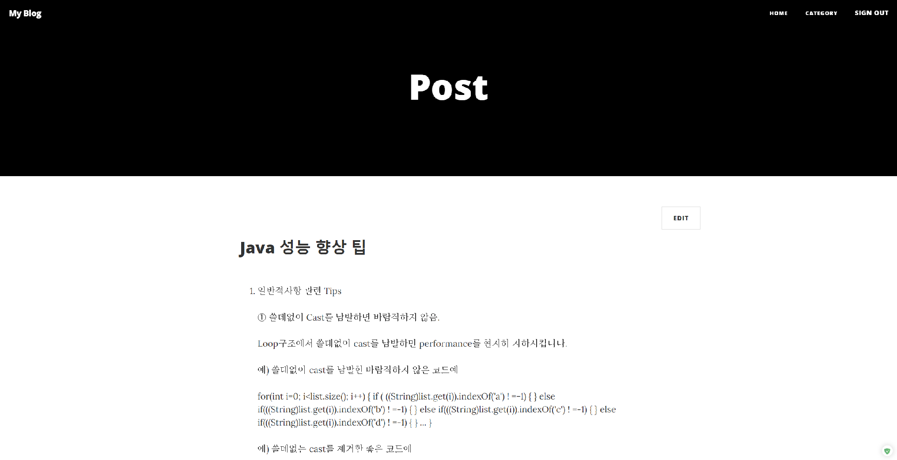
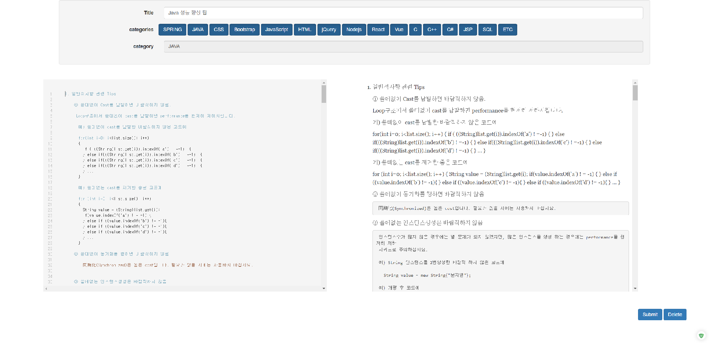
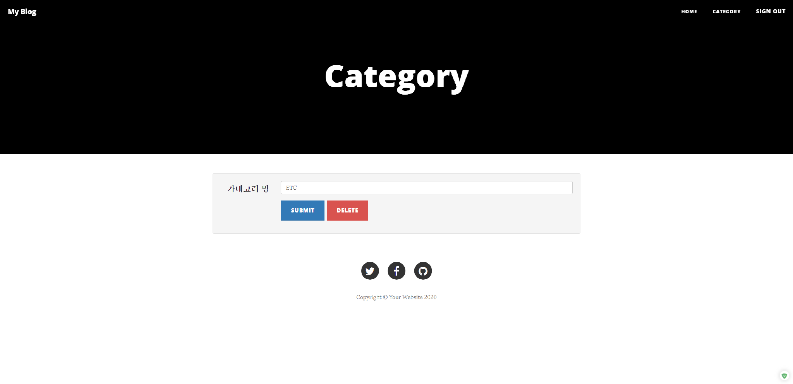
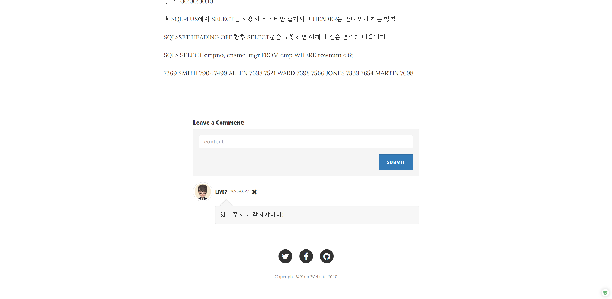

# Blog
-----------------
## 1. 목차
```
.Blog 사이트
├── 1.목차
├── 2.URL
├── 3.개요
├── 4.특징
├── 5.사용법
|   ├── 5.1.개발 환경 & 개발 툴
|   └── 5.2.실행 방법
|       ├── 5.2.1 실행 환경 세팅
|       └── 5.2.2 실행
└── 6.스크린샷
    ├── 6.1.메인 화면
    ├── 6.2.포스트 화면
    ├── 6.3.포스트 작성 및 수정 화면
    ├── 6.4.카테고리 관리 화면
    └── 6.5.댓글 화면
```

## 2. URL 
# http://0254.duckdns.org:9090/blog


## 3. 개요
 - **Spring Framework**로 구현한 **Blog 형식의 사이트**입니다. 
 - 사이트에는 로그인, 포스트, 카테고리, 댓글 등의 기능이 구현되어 있습니다.
 - JPA, Thymeleaf, Github Login API 등 다양한 라이브러리 및 유틸리티를 활용하였습니다. 
 
 
 
## 4. 특징
- JPA를 이용하여 H2 데이터베이스에 엑세스가 가능합니다.
- View는 JSP가 아닌 Thymeleaf라이브러리를 이용하여 구현했습니다..
- Github Login API로 관리자로 등록된 유저만 포스팅 할 수 있고 관리자가 아닌 유저는 댓글을 등록할 수 있습니다.
- 카테고리를 구현하여 포스트 마다 카테고리를 등록할 수 있습니다.
- 외부 markdown에디터를 이용하여 글 작성시 깔끔하게 보이도록 하였습니다.
- 400번대 에러와 500번대 에러페이지를 따로 제작했습니다.
- 반응형 웹페이지로 PC와 MOBILE등 각 기기에 맞도록 최적화된 화면을 보여줍니다.
- aws로 구동하며 도메인을 이용하여 어디에서나 http://0254.duckdns.org:9090/blog 주소를 입력하면 접속이 가능합니다.


## 5. 사용법
### 5.1. 개발 환경 & 개발 툴
- Programing Language : HTML, CSS, JavaScript, Java 8, Thymeleaf
- Framework : Bootstrap, Spring 1.4.0
- Database : H2 Database
- API : Github Login API
- Server : Apache Tomcat 8.5
- OS: Windows 10 
-----------------------------------------------------------------------------
- Tool : Spring Tool Suite, VS code
- Graphic Tool : Adobe Photoshop CC


### 5.2. 실행 방법
#### 5.2.1 실행환경 세팅
```
# 1. Spring Tool Suite에 해당 Blog프로젝트를 import 합니다.
# 2. src/main/resources 폴더에 있는 import.sql 파일을 확인하시기 바랍니다.
- 서버를 실행할 때 해당 sql이 자동으로 실행됩니다.
- 첫번째 sql문은 카테고리를 위한 sql문이며, 두번째 sql문은 맨 처음으로 등록되는 포스트 sql문 입니다.
# 3. 관리자 권한을 얻기 위해 Github Login API를 확인합니다.
- 자신의 아이디로 Github로그인을 한 후 애플리케이션을 등록하여 받은 Client-id와 Client-secret을 복사합니다.
# 4. 복사했던 것을 src/main/resources 폴더에 있는 application.properties 파일의 Client-id와 Client-secret 부분에 그대로 붙여넣기 합니다. 
# 5. 이렇게 하면 세팅은 완료됩니다.
```
#### 5.2.2 실행
```
# 1. 설정이 완료되면 server를 시작하고, 웹 사이트 주소 창에 http://localhost:8080/blog를 입력하시면 됩니다. 
- 포트 번호(8080)는 본인의 컴퓨터에 설정된 톰캣의 포트번호로 변경해주시기 바랍니다. 
# 2. 위의 세팅을 마치고 자신의 깃허브 계정으로 로그인 하면 포스트 작성 및 카테고리 관리가 가능합니다.
# 3. 다른 사람의 계정으로 로그인 했을 경우 글 읽기 및 댓글 작성만 가능합니다.
```


## 6. 스크린샷

### 6.1. 메인 화면
 
 -------------

### 6.2. 포스트 화면
 
 -------------
 
### 6.3. 포스트 작성 및 수정 화면
 
 -------------
  
### 6.4. 카테고리 관리 화면
 
 -------------
  
### 6.5. 댓글 화면
 
 -------------
  


-----------------------------------------------------------------------------
# 감사합니다!
